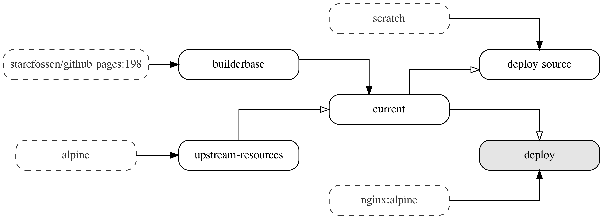

# dockerfilegraph

[](https://goreportcard.com/report/github.com/patrickhoefler/dockerfilegraph)
[](https://codeclimate.com/github/patrickhoefler/dockerfilegraph/maintainability)
[](https://codecov.io/gh/patrickhoefler/dockerfilegraph)

`dockerfilegraph` visualizes your multi-stage Dockerfiles.

It outputs a PDF with a graph representation of the build process. The graph contains the following nodes:

- All _build stages_
- The _default build target_ highlighted in grey
- _External base images_ with dashed borders

The edges of the graph represent:

- _FROM_ dependencies with a full arrow head
- _COPY_ dependencies with an empty arrow head
- _RUN --mount=type=cache_ dependencies with an empty diamond arrow head

## Example Output



## Getting Started

### Prerequisites

- A multi-stage [Dockerfile](https://docs.docker.com/engine/reference/builder/) file in your current working directory

### Installation and Usage

Running `dockerfilegraph` without any arguments will create a `Dockerfile.pdf` in your current working directory. This PDF contains a visual graph representation of your multi-stage Dockerfile.

#### Docker

```text
docker run \
  --rm \
  --workdir /workspace \
  --mount type=bind,source="$(pwd)",target=/workspace \
  ghcr.io/patrickhoefler/dockerfilegraph
```

#### Homebrew

```text
brew install patrickhoefler/tap/dockerfilegraph
dockerfilegraph
```

### More Options

```text
$ dockerfilegraph --help
dockerfilegraph visualizes your multi-stage Dockerfile.
It outputs a graph representation of the build process.

Usage:
  dockerfilegraph [flags]

Flags:
  -d, --dpi int   Dots per inch of the PNG export (default 96)
  -h, --help      help for dockerfilegraph
  -o, --output    Output file format. One of: pdf, png (default pdf)
```

## Build

```text
go build
./dockerfilegraph
```

## License

[MIT](https://github.com/patrickhoefler/dockerfilegraph/blob/main/LICENSE)
