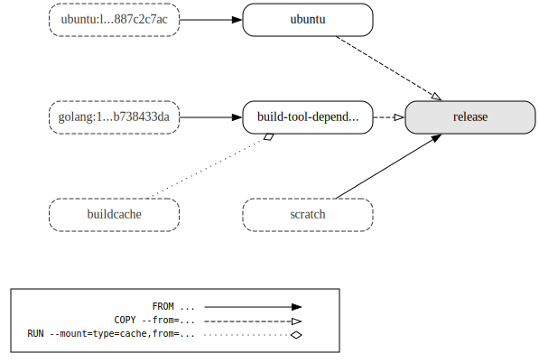
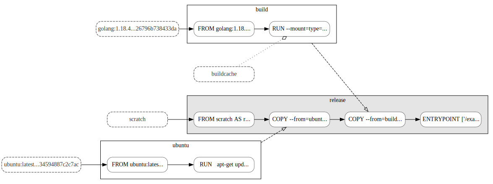

# dockerfilegraph

[](https://github.com/patrickhoefler/dockerfilegraph/actions/workflows/ci.yml?query=branch%3Amain)
[](https://goreportcard.com/report/github.com/patrickhoefler/dockerfilegraph)
[](https://github.com/patrickhoefler/dockerfilegraph/releases/latest)
[](https://github.com/patrickhoefler/dockerfilegraph/blob/main/LICENSE)

`dockerfilegraph` visualizes your multi-stage Dockerfiles.

It uses [Graphviz](https://graphviz.org/) to create a visual representation of the build process.
The build graph contains the following nodes:

- All build stages
- The default build target (highlighted in grey)
- External images (with dashed borders)

The edges of the build graph represent:

- `FROM ...` dependencies
  (with a solid line and a full arrow head)
- `COPY --from=...` dependencies
  (with a dashed line and an empty arrow head)
- `RUN --mount=(.*)from=...` dependencies
  (with a dotted line and an empty diamond arrow head)

You can add an optional legend to the graph and change the output format and resolution.
For all the details, see the [options](#more-options) below.

## Example Output

### Dockerfile graph including a `--legend`



### Dockerfile graph visualizing the image `--layers`



### Complex Dockerfile graph created with `--concentrate --nodesep 0.3 --unflatten 4`


## Getting Started

### Prerequisites

- A multi-stage [Dockerfile](https://docs.docker.com/engine/reference/builder/)

### Installation and Usage

Running `dockerfilegraph` without any arguments will create a `Dockerfile.pdf` in your current working directory.
This PDF contains a visual graph representation of your multi-stage Dockerfile.

#### [docker](https://docker.com/) / [nerdctl](https://github.com/containerd/nerdctl)

##### Image based on Ubuntu 22.04

```shell
docker run \
  --rm \
  --user "$(id -u):$(id -g)" \
  --workdir /workspace \
  --volume "$(pwd)":/workspace \
  ghcr.io/patrickhoefler/dockerfilegraph
```

##### Image based on Alpine Linux

```shell
docker run \
  --rm \
  --user "$(id -u):$(id -g)" \
  --workdir /workspace \
  --volume "$(pwd)":/workspace \
  ghcr.io/patrickhoefler/dockerfilegraph:alpine
```

#### [Homebrew](https://brew.sh/)

```text
brew install patrickhoefler/tap/dockerfilegraph
dockerfilegraph
```

#### [toolctl](https://github.com/toolctl/toolctl)

Make sure that [Graphviz](https://graphviz.org/) is installed locally.

Then:

```text
toolctl install dockerfilegraph
dockerfilegraph
```

#### Build from Source

Make sure that [Graphviz](https://graphviz.org/) is installed locally.

Then:

```text
make build
./dockerfilegraph
```

### More Options

```text
❯ dockerfilegraph --help
dockerfilegraph visualizes your multi-stage Dockerfile.
It creates a visual graph representation of the build process.

Usage:
  dockerfilegraph [flags]

Flags:
  -c, --concentrate             concentrate the edges (default false)
  -d, --dpi uint                dots per inch of the PNG export (default 96)
  -e, --edgestyle               style of the graph edges, one of: default, solid (default default)
  -f, --filename string         name of the Dockerfile (default "Dockerfile")
  -h, --help                    help for dockerfilegraph
      --layers                  display all layers (default false)
      --legend                  add a legend (default false)
  -m, --max-label-length uint   maximum length of the node labels, must be at least 4 (default 20)
  -n, --nodesep float           minimum space between two adjacent nodes in the same rank (default 1)
  -o, --output                  output file format, one of: canon, dot, pdf, png, raw, svg (default pdf)
  -r, --ranksep float           minimum separation between ranks (default 0.5)
  -u, --unflatten uint          stagger length of leaf edges between [1,u] (default 0)
      --version                 display the version of dockerfilegraph
```

## License

[MIT](https://github.com/patrickhoefler/dockerfilegraph/blob/main/LICENSE)
