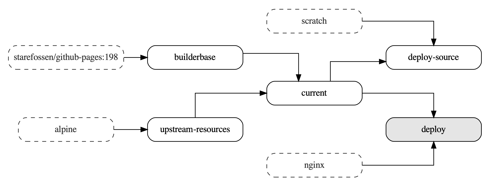

# dockerfilegraph

[](https://goreportcard.com/report/github.com/patrickhoefler/dockerfilegraph)
[](https://codeclimate.com/github/patrickhoefler/dockerfilegraph/maintainability)

`dockerfilegraph` visualizes your multi-stage Dockerfiles. It outputs a PDF that contains the build stages, the default build target (highlighted in grey) as well as the external base images (with dashed borders).

## Example Output



## Getting Started

### Prerequisites

- A multi-stage [Dockerfile](https://docs.docker.com/engine/reference/builder/) file in your current working directory

### Installation and Usage

Running `dockerfilegraph` will create a `Dockerfile.pdf` in your current working directory that contains a visual graph representation of your multi-stage Dockerfile.

#### Docker

```shell
docker run --rm --mount type=bind,source="$(pwd)",target=/dockerfile ghcr.io/patrickhoefler/dockerfilegraph
```

#### Homebrew

```shell
brew install patrickhoefler/tap/dockerfilegraph
dockerfilegraph
```

#### Build

```shell
go build
./dockerfilegraph
```

## License

[MIT](https://github.com/patrickhoefler/dockerfilegraph/blob/main/LICENSE)
