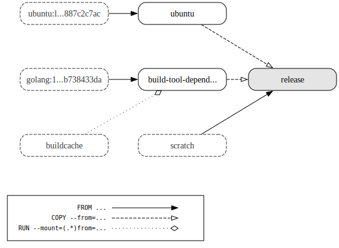
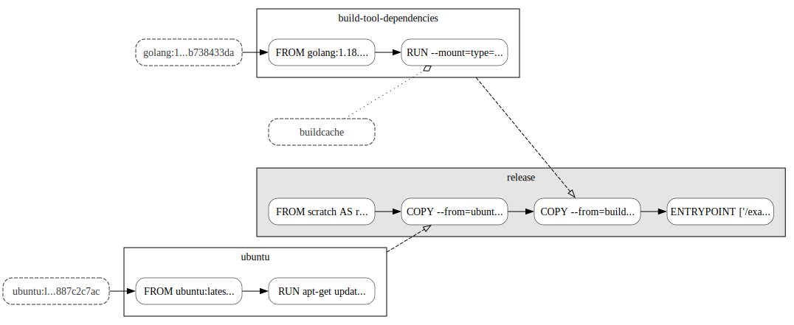

# dockerfilegraph

[](https://github.com/patrickhoefler/dockerfilegraph/actions/workflows/ci.yml?query=branch%3Amain)
[](https://goreportcard.com/report/github.com/patrickhoefler/dockerfilegraph)
[](https://github.com/patrickhoefler/dockerfilegraph/releases/latest)
[](https://github.com/patrickhoefler/dockerfilegraph/blob/main/LICENSE)

A command-line tool that visualizes multi-stage Dockerfiles as dependency graphs.

Uses [Graphviz](https://graphviz.org/) to generate visual representations of Docker build processes, helping you understand build dependencies, document architecture, and debug complex multi-stage builds.

## What You Get

The generated graph includes:

**Nodes:**

- All build stages
- Default build target (highlighted in grey)
- External images (with dashed borders)

**Edges:**

- `FROM ...` dependencies → solid line with full arrow
- `COPY --from=...` dependencies → dashed line with empty arrow
- `RUN --mount=(.*)from=...` dependencies → dotted line with diamond arrow

Supports multiple output formats (PDF, SVG, PNG), a legend, and layout customization options.

## Example Output

### With Legend (`--legend`)



### With Layer Visualization and Hidden Scratch Images (`--layers --scratch hidden`)



### Complex Multi-stage Build (`--concentrate --nodesep 0.3 --unflatten 4`)


## Getting Started

### Prerequisites

- A multi-stage [Dockerfile](https://docs.docker.com/engine/reference/builder/)

### Installation and Usage

Run `dockerfilegraph` in your project directory to generate a `Dockerfile.pdf` with your build graph.

#### Docker

- **Alpine-based** (Graphviz 12.2) - **Default**:

  ```shell
  docker run --rm --user "$(id -u):$(id -g)" \
    -v "$(pwd)":/workspace -w /workspace \
    ghcr.io/patrickhoefler/dockerfilegraph
  ```

- **Ubuntu-based** (Graphviz 2.42):

  ```shell
  docker run --rm --user "$(id -u):$(id -g)" \
    -v "$(pwd)":/workspace -w /workspace \
    ghcr.io/patrickhoefler/dockerfilegraph:ubuntu
  ```

#### Homebrew

```shell
brew install patrickhoefler/tap/dockerfilegraph
dockerfilegraph
```

#### [toolctl](https://github.com/toolctl/toolctl)

*Requirements: [Graphviz](https://graphviz.org/) installed locally*

```shell
toolctl install dockerfilegraph
dockerfilegraph
```

#### Build from Source

- **Native Build**

  *Requirements: `make`, [Go](https://go.dev/) and [Graphviz](https://graphviz.org/)*

  ```shell
  make build
  ./dockerfilegraph
  ```

- **Container Build (Alpine)**

  *Requirements: `make`, [Go](https://go.dev/) and Docker*

  ```shell
  make build-docker-image-alpine
  docker run \
    --rm \
    --user "$(id -u):$(id -g)" \
    --workdir /workspace \
    --volume "$(pwd)":/workspace \
    dockerfilegraph:alpine
  ```

- **Container Build (Ubuntu)**

  *Requirements: `make`, [Go](https://go.dev/) and Docker*

  ```shell
  make build-docker-image-ubuntu
  docker run \
    --rm \
    --user "$(id -u):$(id -g)" \
    --workdir /workspace \
    --volume "$(pwd)":/workspace \
    dockerfilegraph:ubuntu
  ```

## Configuration Options

**Common Flags:**

- `--output svg|png|pdf` - Choose your output format
- `--legend` - Add a legend explaining the notation
- `--layers` - Show all Docker layers

**All Available Options:**

```text
❯ dockerfilegraph --help
dockerfilegraph visualizes your multi-stage Dockerfile.
It creates a visual graph representation of the build process.

Usage:
  dockerfilegraph [flags]

Flags:
  -c, --concentrate             concentrate the edges (default false)
  -d, --dpi uint                dots per inch of the PNG export (default 96)
  -e, --edgestyle               style of the graph edges, one of: default, solid (default default)
  -f, --filename string         name of the Dockerfile (default "Dockerfile")
  -h, --help                    help for dockerfilegraph
      --layers                  display all layers (default false)
      --legend                  add a legend (default false)
  -m, --max-label-length uint   maximum length of the node labels, must be at least 4 (default 20)
  -n, --nodesep float           minimum space between two adjacent nodes in the same rank (default 1)
  -o, --output                  output file format, one of: canon, dot, pdf, png, raw, svg (default pdf)
  -r, --ranksep float           minimum separation between ranks (default 0.5)
      --scratch                 how to handle scratch images, one of: collapsed, hidden, separated (default collapsed)
  -u, --unflatten uint          stagger length of leaf edges between [1,u] (default 0)
      --version                 display the version of dockerfilegraph
```

## Contributing

Found a bug or have a feature request? [Open an issue](https://github.com/patrickhoefler/dockerfilegraph/issues) or submit a pull request.

## License

[MIT](https://github.com/patrickhoefler/dockerfilegraph/blob/main/LICENSE)
